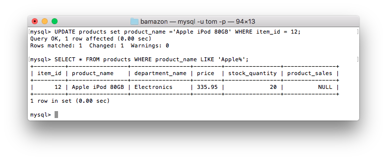

# bamazon
An Amazon-like storefront implemented using node and MySQL.

### About bamazonCustomer.js
When the user runs this script, it will display the current inventory of the store. 

The customer is then asked which product he/she would like to order. The customer is then asked the quantity of the product that should be ordered. These two input values are checked to make sure that they are positive integers. If either input value is not a positive integer, an appropriate error message is displayed. 

If both input values are valid, the script then retrieves the row for the product from the database. If the quantity of the product that the customer wants to purchase exceeds the number of that item that is in stock, an appropriate error message is displayed.

If there is enough inventory to satisfy the customer's request, the quantity that is being ordered is subtracted from the quantity in the inventory, and the updated inventory size is written back to the database. A confirmation message is displayed for the customer, showing the name of the product, the quantity ordered, the unit price of the product and the final total.

### Dependencies
This script requires the following npm packages:

* mysql
* inquirer
* accounting

### How to Run This Script
Enter the following at the command line of your terminal or shell:  ``node bamazonCustomer.js``

### Screenshots
The set of screenshots shown below document the use of this script, starting with the creation and populating of the products table. Each state that the customer can be in is shown.

Hover over a screenshot to see a summary of its contents.

### About bamazonManager.js

This script provides a Manager view of the store. To run the script, simply type:  ``node bamazonManger.js``.

### Dependencies
This script requires the following npm packages:

* mysql
* inquirer
* accounting
* sqlstring

##### Manager's Menu #####
You will be presented with a menu of the available operations.

Make a selection by following the directions on the screen.

##### View Products for Sale #####

If you choose *View Products for Sale*, a table of all of the products in the inventory will be displayed. **[Note that currently there is a slight bug in the way that the table is displayed.]** 

##### View Low Inventory #####

If you choose *View Low Inventory*, a table containing those products whose inventory count is less than five will be displayed. If there are no such products, the message "There are currently no products for which there are less than five in stock." will be displayed.

##### Add to Inventory #####
 
If you choose *Add to Inventory*, you will be prompted for the item_id of the product and the number of items of that product that are being added to the inventory.

##### Add New Product #####

If you choose *Add New Product*, you will be prompted to enter the Product Name, Department, price and initial stock quantity. If errors are detected in the Manager's input, appropriate error messages are displayed.

A confirmation message is displayed if the product is actually added to the database.

